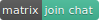

# d.rymcg.tech

[](https://github.com/EnigmaCurry/d.rymcg.tech/blob/master/LICENSE.txt)
[](https://matrix.to/#/#d.rymcg.tech:enigmacurry.com)

This is a collection of Docker Compose projects consisting of
[Traefik](https://doc.traefik.io/traefik/) as a TLS HTTP/TCP/UDP reverse
proxy and other various self-hosted applications and services behind
this proxy. Each project is in its own sub-directory containing its
own `docker-compose.yaml` and `.env-dist` sample config file. This
structure allows you to pick and choose which services you wish to
enable. You may also integrate your own external Docker Compose
projects into this framework.

Each project has a `Makefile` to simplify configuration, installation,
and maintainance tasks. The setup for any sub-project is as easy as
running:

 * `make config` and interactively answering some questions to
   generate the `.env` file automatically.
 * `make install` to deploy the service containers.
 * `make open` to automatically open your web browser to the newly
   deployed application URL.

Under the covers, setup is pure `docker compose`, with *all*
configuration derived from your customized `.env` file.

# Contents

- [All configuration comes from the environment](#all-configuration-comes-from-the-environment)
- [Prerequisites](#prerequisites)
- [Setup Workstation](#setup-workstation)
- [Main configuration](#main-configuration)
- [Install applications](#install-applications)
- [Command line interaction](#command-line-interaction)
- [Creating multiple instances of a service](#creating-multiple-instances-of-a-service)
- [Backup .env files](#backup-env-files-optional)
- [Integrating external projects](#integrating-external-projects)
- [Questions and discussion](#questions-and-discussion)

## All configuration comes from the environment

All of these projects are configured soley via environment variables
written to Docker [.env](https://docs.docker.com/compose/env-file/)
files.

The `.env` files for each application instance are to be kept secret
because they include things like passwords and keys, and these should
be kept on a secure workstation and not commited to git (they are
ignored via `.gitignore`) . Each project includes a `.env-dist` file,
which is a sample that must be copied to create your own secret `.env`
file and edited according to the example. (Or run `make config` to run
a setup wizard to create the `.env` file for you by answering some
questions interactively.)

For containers that do not support environment variable configuration,
a sidecar container is included (usually called `config`) that will
generate a config file from a template including these environment
variables, and is run automatically before the main application starts
up (therefore the config file is dynamically generated at each
startup).

This project stores all application data in Docker **named volumes**.
Many samples of docker-compose that are written by other people, and
that you may find out there on the internet, will map native host
directories into their container paths. **Host-mounted directories are
considered an anti-pattern and will never be used in this project,
unless there is a compelling reason to do so.** For more information
see [Rule 3 of the 12 factor app
philosophy](https://12factor.net/config). By following this rule, you
can use Docker from a remote client (like your laptop, accessing a
remote Docker server over SSH). More importantly, you can ensure that
all of the dependent files are fully contained by Docker itself
(`/var/lib/docker/volumes/...`), and therefore the entire application
state is managed as part of the container/volume lifecycle.

## Prerequisites
### Create a Docker host (server)

[Install Docker
Server](https://docs.docker.com/engine/install/#server) on your own
public internet server or cloud host. You may also install to a
private server behind a firewall (but in this case be sure to setup
the Traefik ACME DNS Challenge, because the default TLS challenge
requires an open port 443 public to the internet).

See [SECURITY.md](SECURITY.md) for a list of security concerns when
choosing a hosting provider.

As one example, see [DIGITALOCEAN.md](DIGITALOCEAN.md) for
instructions on creating a secure Docker host on DigitalOcean.

If you need a semi-private development or staging server, and want to
be able to share some public URLs for your services, you can protect
your services by turning on Traefik's [HTTP Basic
Authentication](https://doc.traefik.io/traefik/middlewares/http/basicauth/)
or [OAuth2 Authentication](traefik/README.md#oauth2-authentication)
and
[IPWhitelist](https://doc.traefik.io/traefik/middlewares/http/ipwhitelist/)
middlewares (see
[s3-proxy](https://github.com/EnigmaCurry/d.rymcg.tech/blob/f77aaaa5a2705eedaf29a4cdc32f91cdb65e66f7/s3-proxy/docker-compose.yaml#L35-L41)
for an example that uses both of these), or by turning on [Oauth2
authentication](https://github.com/EnigmaCurry/d.rymcg.tech/tree/master/traefik-forward-auth)
,or you can make an exclusively private Traefik service with a
[Wireguard](https://github.com/EnigmaCurry/d.rymcg.tech/tree/master/traefik#wireguard-vpn)
VPN.

For local development purposes, you can [install Docker on a raspberry
pi](RASPBERRY_PI.md) or you can [install Docker in a virtual
machine](_docker_vm#readme) (in all scenarios you will remotely
control Docker from your native workstation), this ensures that your
development environment is deployed in the same way as you would a
production server. Never install Docker on your native
workstation/desktop! (Or, if you do, never give your normal user
account any docker privileges!) See [_docker_vm](_docker_vm#readme)
for details on how and why to install Docker in KVM/Qemu. Please note
that Docker Desktop is not currently supported because [it does not
support host
networking](https://docs.docker.com/network/network-tutorial-host/),
and the Traefik configuration relies upon this (if you know a way
around this, please open an issue/PR). (If you don't use Linux on your
workstation, you may have better luck installing Docker yourself
inside of a traditional virtual machine like VMWare or Virtualbox, and
then setting up an SSH service so you can access the VM remotely from
your native desktop (the docker *client* works just fine from WSL2);
or even easier would be to [install Docker on a raspberry
pi](https://github.com/EnigmaCurry/d.rymcg.tech/blob/master/RASPBERRY_PI.md)
and connect it on your LAN.

### Setup DNS for your domain and Docker server

You need to bring your own internet domain name and DNS service. You
will need to create DNS type `A` records (or `AAAA` records if using
IPv6) pointing to your docker server. There are many different DNS
platforms that you can use, but see [DIGITALOCEAN.md](DIGITALOCEAN.md)
for one example.

It is recommended to dedicate a sub-domain for this project, and then
create sub-sub-domains for each application. This will create domain
names that look like `whoami.d.example.com`, where `whoami` is the
application name, and `d` is a unique name for the overall sub-domain
representing your docker server (`d` is for `docker`, but you can make
this whatever you want).

By dedicating a sub-domain for all your projects, this allows you to
create a DNS record for the wildcard: `*.d.example.com`, which will
automatically direct all sub-sub-domain requests to your docker
server.

Note that you *could* put a wildcard record on your root domain, ie.
`*.example.com`, however if you did this you would not be able to use
the domain for a second instance, but if you're willing to dedicate
the entire domain to this single instance, go ahead.

If you don't want to create a wildcard record, you can just create
several normal `A` (or `AAAA`) records for each of the domains your
apps will use, but this might mean that you need to come back and add
several more records later as you install more projects, (and also
complicates the TLS certificate creation process) but this would let
you freely use whatever domain names you want.

### Notes on firewall

This system does not include a network firewall of its own. You are
expected to provide this in your host networking environment. (Note:
`ufw` is NOT recommended for use with Docker, nor is any other
firewall that is directly located on the same host machine as Docker.
You should prefer an external dedicated network firewall [ie. your
cloud provider, or VM host]. If you have no other option but to run
the firewall on the same machine, check out
[chaifeng/ufw-docker](https://github.com/chaifeng/ufw-docker#solving-ufw-and-docker-issues)
for a partial fix.)

With only a few exceptions, all network traffic flows through one of
several Traefik entrypoints, listed in the [static configuration
template](traefik/config/traefik.yml) (`traefik.yml`) in the
`entryPoints` section.

Each entrypoint has an associated environment variable to turn it on
or off. See the [Traefik](traefik) configuration for more details.

Depending on which services you actually install, and how they are
configured, you may need to open these ports in your firewall:

| Type       | Protocol | Port Range | Description                                               |
|------------|----------|------------|-----------------------------------------------------------|
| SSH        | TCP      | 22         | Host SSH server (direct-map)                              |
| HTTP       | TCP      | 80         | Traefik HTTP entrypoint (web; redirects to websecure)     |
| HTTP+TLS   | TCP      | 443        | Traefik HTTPS entrypoint (websecure)                      |
| TCP socket | TCP      | 1704       | Traefik Snapcast (audio) entrypoint                       |
| TCP socket | TCP      | 1705       | Traefik Snapcast (control) entrypoint                     |
| SSH        | TCP      | 2222       | Traefik Gitea SSH (TCP) entrypoint                        |
| SSH        | TCP      | 2223       | SFTP container SSH (TCP) (direct-map)                     |
| TLS        | TCP      | 5432       | PostgreSQL mTLS DBaaS (direct-map)                        |
| TCP socket | TCP      | 6600       | Traefik Mopidy (MPD) entrypoint                           |
| HTTP       | TCP      | 8000       | Traefik HTTP entrypoint (web_plain; explicitly non-https) |
| TLS        | TCP      | 8883       | Traefik MQTT (TLS) entrypoint                             |
| WebRTC     | UDP      | 10000      | Jitsi Meet video bridge (direct-map)                      |
| VPN        | UDP      | 51820      | Wireguard (Traefik VPN)  (direct-map)                     |

The ports that are listed as `(direct-map)` are not connected to
Traefik, but are directly exposed (public) to the docker host network.

For a minimal installation, you only need to open ports 22 and 443.
This would enable all of the web-based applications to work, except
for the ones that need an additional port, as listed above.

See [DIGITALOCEAN.md](DIGITALOCEAN.md) for an example of setting the
DigitalOcean firewall service.

Later, after you've deployed things, you can audit all of the open
published ports: from the root project directory, run `make
show-ports` to list all of the services with open ports (or those that
run in the host network and are therefore completely open. You will
find traefik and the wireguard server/client in this latter category).
Each sub-project directory also has a `make status` with useful
per-project information.

## Setup Workstation

Your local "workstation" is assumed to be a Linux desktop/laptop
computer, or another Linux system that you remotely connect to via
SSH:

 * Tested workstation architectures:
   * Linux x86_64 (64 bit Intel or AMD)
   * Linux aarch64 (64 bit ARM)
   * Arch Linux and Ubuntu have been regularly tested.
 * Other operating systems and architectures have not been tested, and
may require customization (please [open an
issue](https://github.com/EnigmaCurry/d.rymcg.tech/issues)).
 * Your workstation should not be the same machine as the docker
   server (unless docker is in its own virtual machine).

### Install Docker CLI tools

You need to install the following tools on your local workstation:

 * [Install docker client](https://docs.docker.com/get-docker/) (For
   Linux, install Docker Engine, but not necessarily starting the
   daemon; the `docker` client program and `ssh` are all you need
   installed on your workstation to connect to a remote docker server.
   For Mac/Windows, install Docker Desktop, or use your own Linux
   Virtual Machine and install Docker Engine.)
 * [Install docker-compose
   v2.x](https://docs.docker.com/compose/cli-command/#installing-compose-v2)
   (For Docker Desktop, `docker compose` is already installed. For
   Linux, it is a separate installation.)
 * [Install docker
   buildx](https://docs.docker.com/build/buildx/install/) (optional,
   and *none* of the projects require it) - "Docker Buildx, is a CLI
   plugin that extends the docker command with the full support of the
   features provided by BuildKit builder toolkit." and it allows you
   to do cool things like [Heredocs in
   Dockerfiles](https://www.docker.com/blog/introduction-to-heredocs-in-dockerfiles/).

For Arch Linux, run: `sudo pacman -S docker docker-compose docker-buildx`

For Debian or Ubuntu, you should strictly follow the directions from
the links above and install only from the docker.com third party apt
repository (because the docker packages from the Ubuntu repositories
are always out of date).

You do not need to (and perhaps *should not*) run the Docker Engine on
your local workstation. You will use the `docker` client exclusively to
control a *remote* docker server (or VM). To turn off/disable the
Docker Engine on your worksation, run the following:

```
## Disable local Docker Engine:
sudo systemctl mask --now docker
```

#### Enable Docker buildx (optional)

Following the [buildx installation
guide](https://docs.docker.com/build/buildx/install/), and run the
installation:

```
docker buildx install
```

### Install workstation tools

The Makefiles have extra dependencies in order to help configure and
manage your containers. These dependencies are optional, but strongly
recommended. (The Makefiles are strictly convenience wrappers for
creating/modifying your `.env` files, and for running `docker compose`
commands, so if you would rather just edit your `.env` files by hand
and/or run `docker compose` manually, these dependencies may be
skipped):

   * Base development tools including `bash`, `make`, `sed`, `xargs`, and
     `shred`.
   * `openssl` (for generating randomized passwords)
   * `htpasswd` (for encoding passwords for Traefik Basic Authentication)
   * `jq` (for processing JSON)
   * `sshfs` (for mounting volumes used by the [sftp](sftp) container)
   * `xdg-open` (Used for automatically opening the service URLs in
      your web-browser via `make open`. Don't install this if your
      workstation is on a headless server, as it depends on
      Xorg/Wayland. Without installing `xdg-open`, it will degrade to
      simply printing the URL that you can copy and paste.)
   * `wireguard` (client for connecting to the [traefik
     wireguard](traefik#wireguard-vpn) VPN)
   * `curl` (for downloading an installing external dependencies:
     [script-wizard](https://github.com/enigmacurry/script-wizard))

On Arch Linux, run this to install all these dependencies:

```
pacman -S bash base-devel openssl apache xdg-utils jq sshfs wireguard-tools curl
```

For Debian or Ubuntu, run:

```
apt-get install bash build-essential openssl apache2-utils xdg-utils jq sshfs wireguard curl
```

### Setup SSH access to the server

Make sure that your local workstation user account is setup for SSH
access to the remote docker server (ie. you should be able to ssh to
the remote server `root` account, or another account that has been
added into the `docker` group). You should setup key-based
authentication so that you don't need to enter passwords during login,
as each `docker` command will need to authenticate via SSH.

 * See the general article [How to Set Up SSH
   Keys](https://www.digitalocean.com/community/tutorials/how-to-set-up-ssh-keys-2)
 * Make sure to turn off regular password authentication, set
   `PasswordAuthentication no` in the server config.
 * Check out this [SSH Hardening
   Guide](https://www.sshaudit.com/hardening_guides.html) for
   disabling outdated key types.
 * If your workstation's operating system does not automatically provide an
   ssh-agent (to make it so you don't have to keep typing your key's
   passphrase), check out
   [Keychain](https://wiki.archlinux.org/title/Keychain#Keychain) for an easy
   solution.

When set for a remote Docker context, the `docker` command will create
a new SSH connection for each time it is run. This can be especially
slow for running several commands in a row. You can speed the
connection time up, by enabling SSH connection multiplexing, which
starts a single background connection and makes new connections re-use
this existing connection.

On your workstation, create or edit your existing
`${HOME}/.ssh/config` file. Add the following configuration (replacing
`ssh.d.example.com` with your own docker server hostname, and `root`
for the user account that controls Docker):

```
Host ssh.d.example.com
    User root
    ControlMaster auto
    ControlPersist yes
    ControlPath /tmp/ssh-%u-%r@%h:%p
```

(The hostname `ssh.d.example.com` relies upon the wildcard
`*.d.example.com` or an explicit `A` record having been created for
this hostname.)

Note: if you use a workstation that goes to sleep, or loses network
connectivity, you may find that your shared+multiplexed SSH
connections will sometimes become zombies and stop communication. Get
used to running `killall ssh` before trying to restablish the
connection.

### Set remote Docker context

On your local workstation, create a new [Docker
context](https://docs.docker.com/engine/context/working-with-contexts/)
to use with your remote docker server (eg. named `d.example.com`) over
SSH:

```
docker context create d.example.com --docker "host=ssh://ssh.d.example.com"
docker context use d.example.com
```

(To benefit from connection multiplexing, make sure to use the exact
Host name [`ssh.d.exmaple.com`] that you specified in your
`${HOME}/.ssh/config`)

Now whenever you issue `docker` commands on your local workstation,
you will actually be controlling your remote Docker server through
SSH, and you can easily switch contexts between multiple server
backends.

For example, I have three docker contexts, for three different remote
Docker servers:

```
$ docker context ls
NAME              DESCRIPTION  DOCKER ENDPOINT
d.rymcg.tech *                 ssh://ssh.d.rymcg.tech
docker-vm                      ssh://docker-vm
pi                             ssh://pi
```

(The `*` indicates my current context.)

I can select to use which context I want to use:

```
$ docker context use docker-vm
Current context is now "docker-vm"
```

(This is a permanent setting that will survive a workstation reboot.
Use the same command again to switch to any other context.)

### Clone this repository to your workstation

```
git clone https://github.com/EnigmaCurry/d.rymcg.tech.git \
    ${HOME}/git/vendor/enigmacurry/d.rymcg.tech

cd ${HOME}/git/vendor/enigmacurry/d.rymcg.tech
```

You may clone to any path you like, but the path suggested above is a
vendor neutral way of organizing third party repositories, with the
intention of making the same path work on all machines.

## Main configuration

Run the configuration wizard, and answer the questions:

```
## Run this command inside the root source directory of d.rymcg.tech:
make config
```

Running `make config`, in the root project directory, writes the main
project level variables into a file named `.env_${DOCKER_CONTEXT}`
(eg. `.env_d.example.com`) in the root source directory, based upon
the name of the current Docker context. This file is excluded from the
git repository via `.gitignore`.)

All of the Makefiles depend on a helper utility called
[script-wizard](https://github.com/enigmacurry/script-wizard), which
is automatically installed the first time you run `make config`.

This will also check your system for the dependencies and alert you if
you need to install something.

The `ROOT_DOMAIN` variable is saved in `.env_${DOCKER_CONTEXT}` and
will serve as the default root domain of all of the sub-project
domains, so that when you run `make config` in any of the sub-project
directories, the default (yet customizable) domain will be
pre-populated with this root domain suffix.

You can have multiple `.env_${DOCKER_CONTEXT}` files, one for each
Docker server, named after the associated Docker context. To switch
the current .env file being used, change the Docker context:

```
docker context use {CONTEXT}
```

## Install applications

Each of the sub-projects have their own `README.md`. You should
install [Traefik](traefik) first, as almost all of the others depend
on it. After that, install the [whoami](whoami) service to test that
things are working correctly.

Install these first:

* [Traefik](traefik#readme) - HTTP / TLS / TCP / UDP reverse proxy
* [Whoami](whoami#readme) - HTTP test service

Install these recommended backbone applications next:

* [Gitea](gitea#readme) - Git host (like self-hosted GitHub) and
  OAuth2 server.
  * A great self-hosted git forge.
  * Great self-hosted OAuth2 identity service, which supports 2FA
    including hardware tokens, even if you have no need for a git
    forge.
* [Traefik-forward-auth](traefik-forward-auth#readme) - Traefik OAuth2
  authentication middleware.
  * Required if you want OAuth2 authentication. You'll combine this
    with your gitea instance (or another external Oauth provider) to
    add authentication to any of your apps.
* [Homepage](homepage#readme) - an application dashboard with several integrations
  * Homepage acts as a dashboard or launcher for all your other apps.
  * Not required for any other functionality.

Install these other services at your leisure/preference:

* [ArchiveBox](archivebox#readme) - a website archiving tool
* [Audiobookshelf](audiobookshelf#readme) - an audiobook and podcast server
* [Autoheal](autoheal#readme) - a Docker container healthcheck monitor with auto-restart service
* [Baikal](baikal#readme) - a lightweight CalDAV+CardDAV server
* [CalcPad](calcpad#readme) - a different take on the caculator
* [CryptPad](cryptpad#readme) - a collaborative document and spreadsheet editor
* [DrawIO](drawio#readme) - a diagram / whiteboard editor tool
* [Ejabberd](ejabberd#readme) - an XMPP (Jabber) server
* [Filestash](filestash#readme) - a web based file manager with customizable backend storage providers
* [FreshRSS](freshrss#readme) - an RSS reader / proxy
* [Grocy](grocy#readme) - a grocery & household management/chore solution
* [Icecast](icecast#readme) - a SHOUTcast compatible streaming multimedia server
* [Invidious](invidious#readme) - a Youtube proxy
* [Jitsi Meet](jitsi-meet#readme) - a video conferencing and screencasting service
* [Jupyterlab](jupyterlab#readme) - a web based code editing environment / reproducible research tool
* [Larynx](larynx#readme) - a speech synthesis engine
* [Lemmy](lemmy#readme) - a link aggregator and forum for the fediverse
* [Matterbridge](matterbridge#readme) - a chat room bridge (IRC, Matrix, XMPP, etc)
* [Maubot](maubot#readme) - a matrix Bot
* [Minio](minio#readme) - an S3 storage server
* [Mopidy](mopidy#readme) - a streaming music server built with MPD and Snapcast
* [Mosquitto](mosquitto#readme) - an MQTT server
* [Nextcloud](nextcloud#readme) - a collaborative file server
* [Node-RED](nodered#readme) - a graphical event pipeline editor
* [Ntfy.sh](ntfy.sh#readme) - a simple HTTP-based pub-sub notification service
* [Pairdrop](pairdrop#readme) - a webapp (PWA) to send files and messages peer to peer.
* [Photoprism](photoprism#readme) - a photo gallery and manager
* [Piwigo](piwigo#readme) - a photo gallery and manager
* [Plausible](plausible#readme) - a privacy friendly web visitor analytics engine
* [PostgreSQL](postgresql#readme) - a database server configured with mutual TLS authentication for public networks
* [PrivateBin](privatebin#readme) - a minimal, encrypted, zero-knowledge, pastebin
* [Prometheus](prometheus#readme) - a systems monitoring and alerting toolkit (+ node-exporter + cAdvisor + Grafana)
* [QBittorrent-Wireguard](qbittorrent-wireguard#readme) - a Bittorrent (libtorrent v2) client with a combined VPN client
* [Rdesktop](rdesktop#readme) - a web based remote desktop (X11) in a container
* [Redbean](redbean#readme) - a small website server bundled in a single executable zip file.
* [S3-proxy](s3-proxy#readme) - an HTTP directory index for S3 backend
* [SFTP](sftp#readme) - a secure file server
* [Shaarli](shaarli#readme) - a bookmark manager
* [Smokeping](smokeping#readme) - a network latency measurement tool
* [Syncthing](syncthing#readme) - a multi-device file synchronization tool
* [Sysbox-Systemd](sysbox-systemd#readme) - a traditional service manager for Linux running in an unprivileged container via sysbox-runc
* [Thttpd](thttpd#readme) - a tiny/turbo/throttling HTTP server for serving static files
* [TiddlyWiki (WebDAV version)](tiddlywiki-webdav#readme) - a personal wiki stored in a single static HTML file
* [TiddlyWiki (NodeJS version)](tiddlywiki-nodejs#readme) - Advanced server edition of TiddlyWiki with image CDN
* [Transmission-Wireguard](transmission-wireguard#readme) - An older but very popular Bittorrent (v1) client with a combined VPN client
* [Tiny Tiny RSS](ttrss#readme) - an RSS reader / proxy
* [Vaultward](vaultwarden#readme) - a bitwarden compatible password manager written in Rust (formerly bitwarden_rs)
* [Websocketd](websocketd#readme) - a websocket / CGI server
* [Wordpress](wordpress#readme) - an ubiquitous blogging / CMS platform, with a plugin to build a static HTML site snapshot.
* [XBrowserSync](xbs#readme) - a bookmark manager

Bespoke things:

* [certificate-ca](_terminal/certificate-ca) Experimental ad-hoc certifcate CA. Creates
  self-signed certificates for situations where you don't want to use Let's
  Encrypt.
* [Linux Shell Containers](_terminal/linux) create Bash aliases that
  automatically build and run programs in Docker containers.
* [_docker_vm](_docker_vm#readme) Run Docker in a Virtual Machine (KVM) on Linux.

## Command line interaction

As alluded to earlier, this project offers multiple ways to control
Docker:

 1. Editing `.env` files by hand, and running `docker compose`
    commands yourself (this is a usable, but lower level, base
    abstraction).
 2. Running `make` targets that edit the `.env` files automatically
    and runs `docker compose` for you (this is the author's preferred
    method, and the one that most of the documentation will actually
    use).
 3. Running the `d.rymcg.tech` CLI script, which runs the `make`
    targets from any working directory. (This method also includes
    extra features such as creating your own new projects from
    templates.)

All of these methods are compatible, and they will all get you to the
same place. The Makefiles offer a more streamlined approach with a
configuration wizard and sensible defaults. Most of the sub-project
README files reflect the `make` command style for config. Editing the
`.env` files by hand still offers you more control, with more freedom
for experimentation, and this option always remains available.

### Using the Makefiles

Each project has a `Makefile` that helps to simplify installation and
maintainance. You can use the Makefiles to automatically edit the
`.env` files and to start the services for you (and this way you won't
have to run any docker commands by hand).

The most important thing to know is that `make` looks for a `Makefile`
in your *current* working directory. `make` is contextual to the
directory you are in.

 * `cd` into the sub-project directory of an app you want to install.
 * Read the `README.md` file.
 * Run `make config`
 * Answer the interactive questions, and the
   `.env_${DOCKER_CONTEXT}_default` file will be created/updated for
   you (named with your current docker context, eg.
   `.env_d.example.com_default`). The answers are pre-populated with
   default values from `.env-dist` (and based upon your `ROOT_DOMAIN`
   specified earlier). You can accept the suggested default values, or
   use the backspace key and edit the value, to fill in your own
   answers.
 * The suffix of the .env filename, `_default`, refers to the
   [instance](#creating-multiple-instances-of-a-service) of the
   service (each instance has a different name, with `_default` being
   the default name. This default name is typical only when you are
   deploying a single instance, otherwise you should use a unique name
   for each instance.)
 * Verify the configuration by looking at the contents of
   `.env_${DOCKER_CONTEXT}_default`.
 * Run `make install` to start the services. (this is the same thing as
   `docker compose up --build -d`)
 * Most services have a website URL, which you can open automatically,
   run: `make open` (requires `xdg-utils`, otherwise it will print the
   URL and you can copy and paste it).
 * See `make help` (or just run `make`) for a list of all the other available
   targets, including `make status`, `make start`, `make stop` and `make
   destroy`. Be sure to recognize that `make` has tab completion in Bash :)
 * You can also run `make status` in the root directory of the cloned
   source. This will list all of the installed/running applications.

`make config` *does not literally* create a file named `.env`, but
rather one based upon the current docker context:
`.env_${DOCKER_CONTEXT}_default`. This allows for different
configurations to coexist in the same directory. All of the `make`
commands operate assuming this contextual environment file name, *not*
`.env`. To switch between configs, you switch your current docker
context: `docker context use {CONTEXT}`.

During `make config`, you will sometimes be asked to create HTTP Basic
Authentication passwords, and these passwords can be *optionally*
saved into a file named `passwords.json` inside the sub-project
directory. This file is a convenience, so that you can remember the
passwords that you create. **`passwords.json` is stored in plain
text**, but excluded from being checked into git via `.gitignore`.
When you run `make open` the username and password stored in this file
is automatically applied to the URL that the browser is asked to open,
thus logging you into the website account automatically. To delete all
of the passwords.json files, you can run `make delete-passwords` in
the root directory of this project (or `make clean` which will delete
the `.env` files too).

For a more in depth guide on using the Makefiles, see
[MAKEFILE_OPS.md](MAKEFILE_OPS.md)

### Using the `d.rymcg.tech` CLI script (optional)

By default, both `make` and `docker compose` expect you to change your
working directory to use them, and so this is sometimes inconvenient.
You *can* work around this by using `make -C` or `docker compose -f`,
but another option is to use the eponymous [`d.rymcg.tech`
script](_scripts/d.rymcg.tech) that is included in this repository.

In addition to letting you run any project's `make` targets from any
working directory, this shell script also offers a convenient way to
create [external projects](#integrating-external-projects) from a
skeleton template, and to create shorter command aliases for any
project.

To install the script, you need to add it to your `PATH` shell
variable, and at your option, evaluate the Bash shell tab completion
script:

```
#### To enable Bash shell completion support for d.rymcg.tech,
#### add the following lines into your ~/.bashrc ::
export PATH=${PATH}:${HOME}/git/vendor/enigmacurry/d.rymcg.tech/_scripts/user
eval "$(d.rymcg.tech completion bash)"
```

Once installed, run `d.rymcg.tech` to see the command help text.

```
## Main d.rymcg.tech sub-commands:
cd             Enter a sub-shell and go to the ROOT_DIR directory
create         Create a new external project
make           Run a make command for the given d.rymcg.tech project name

## Documentation sub-commands:
help                  Show this help screen
list                  List available d.rymcg.tech projects
                      (not including external projects, unless you symlink them into ROOT_DIR)
readme [PROJECT]      Open the README.md for the given project name
readme                Open the main d.rymcg.tech README.md in your browser
readme raspberry_pi   Open the RASPBERRY_PI.md documentation
readme makefile_ops   Open the MAKEFILE_OPS.md documentation
readme security       Open the SECURITY.md documentation
readme digitalocean   Open the DIGITALOCEAN.md documentation
readme license        Open the LICENSE.txt software license
```

You can use this script to run the make targets for any of the bundled
projects, usable from any working directory, and with full tab
completion support:

 * `d.rymcg.tech list` (retrieve list of all available projects)
 * `d.rymcg.tech make -- status` (view status of all installed
   projects)
 * `d.rymcg.tech make traefik config` (run the Traefik `make config` target)
 * `d.rymcg.tech make traefik install` (run the Traefik `make install` target)
 * `d.rymcg.tech make whoami logs` (run the whoami `make logs` target)
 * `d.rymcg.tech make piwigo logs SERVICE=db` (you can also add any
   variable assignments, just like with `make`)

`d.rymcg.tech make [PROJECT_NAME] ...` is a simple wrapper for `make
-C ~/git/vendor/enigmacurry/d.rymcg.tech/${PROJECT_NAME} ...` (the
script will detect the correct path that you cloned to) so that you
can run all of the same things as outlined in
[MAKEFILE_OPS.md](MAKEFILE_OPS.md), but from any directory. The
special project placeholder value `-` (any number of consecutive
dashes) indicates to use the [root Makefile](Makefile) rather than any
particular project Makefile.

You can get into the root d.rymcg.tech directory quickly, from
anywhere:

```
## This enters a subshell and changes the working directory to the d.rymcg.tech root:
## (You can also specify a second argument to specify the sub-directory.)
d.rymcg.tech cd
```

Press `Ctrl-D` to exit the sub-shell and jump back to wherever you
came from.

From any working directory, you can create a new, [external
project](#integrating-external-projects), based upon one of the
[included templates](_templates):

```
# This creates a new project directory in your current working directory:
# It will ask you to enter the name of the project and choose the template.
# Optional 2nd and 3rd args will skip the asking: PROJECT_NAME TEMPLATE_NAME
d.rymcg.tech create
```

Open any project's README file directly in your web browser:

```
## Open the main README
d.rymcg.tech readme

## Open the Traefik README
d.rymcg.tech readme traefik
```

#### Project specific shell aliases

You can add additional command aliases to your shell (put these in
your `~/.bashrc` *after* the `eval` line that loads the main
`d.rymcg.tech` script):

```
## Example project alias: creates a shorter command used just for the Traefik project:
__d.rymcg.tech_project_alias traefik
```

(This command creates the shell alias called `traefik`, as well as the
Bash shell tab completion for it.)

With this alias installed, instead of running `make -C
~/git/vendor/enigmacurry/d.rymcg.tech/traefik install` you can now
simply run `traefik install`.

If you have created an [external
project](#integrating-external-projects) (eg. named `mikeapp`), you can
create a command alias for it:

```
## Example external project alias:
__d.rymcg.tech_project_alias mikeapp ~/git/mikeapp
```

With this alias installed, instead of running `make -C ~/git/mikeapp
install` you can now simply run `mikeapp install`.

If you want a different alias for the main script, you can add that too:

```
## Alternative alias to d.rymcg.tech
__d.rymcg.tech_cli_alias dry
```

With this alias installed, you can now run `dry` in place of
`d.rymcg.tech`.

To get a synopsis of all of these completion commands, run:

```
d.rymcg.tech completion
```

### Using `docker compose` by hand (optional)

This project was originally designed to be a pure docker compose
project, and it still is. The `make` commands or the `d.rymcg.tech`
wrapper script are the recommended methods to use, however you can
still use `docker compose` by hand if you wish.

For all of the containers that you wish to install, do the following:

 * Read the README.md file found in the sub-project directory.
 * Open your terminal and `cd` to the project directory containing
   `docker-compose.yaml`
 * Copy the example `.env-dist` to `.env`
 * Edit all of the variables in `.env` according to the example and comments.
 * Create a
   [`docker-compose.override.yaml`](https://docs.docker.com/compose/extends/#multiple-compose-files)
   file by hand, copying from the template given in
   `docker-compose.instance.yaml` (If the project does not have this
   file, you can skip this step.) This [ytt](https://carvel.dev/ytt/)
   template is mainly used for the service container labels, and has
   logic for choosing which Traefik middlewares to apply. So you just
   need to remove (comment out) the lines that don't apply in your
   case. The override files are not committed into git, as they are
   normally dynamically generated by the Makefiles and rendering from
   the template on the fly. If you want to maintain these files by
   hand, you can remove the exclusion of them from the
   [.gitignore](.gitignore) and commit them with your own forked
   repository.
 * Follow the README for instructions to start the containers.
   Generally, all you need to do is run: `docker compose up --build
   -d` (This is the same thing that `make install` does)

When using `docker compose` by hand, it uses the `.env` file name by
default. To use any other filename, specify the `--env-file` argument
(eg. when deploying multiple instances).

## Creating multiple instances of a service

By default, each project supports deploying a single instance per
Docker context. The singleton instance environment file is named
`.env_${DOCKER_CONTEXT}_default`, which is contained in each project
subdirectory (eg. `whoami/.env_d.example.com_default`).

If you want to deploy more than one instance of a given project (and
to the same docker context, and from the same source directory), you
need to create a separate environment file for each one. The
convention that the Makefile expects is to name your several
environment files like this: `.env_${DOCKER_CONTEXT}_${INSTANCE_NAME}`
(eg. `whoami/.env_d.example.com_foo`).

Not every project supports instances yet (nor does it make sense to in
some cases), it is opt-in for each project, by including the
[Makefile.instance](_scripts/Makefile.instance) file at the top of
their own Makefile.

By default, all of the `make` targets will use the default
environment, but you can tell it use the instance environment instead,
by setting the `instance` (or `INSTANCE`) variable:

```
make instance=foo config  # Configure a new or existing instance named foo
make instance=bar config  # (Re)configures bar instance
make instance=foo install # This (re)installs only the foo instance
make instance=bar install # (Re)installs only bar instance
make instance=foo ps      # This shows the containers status of the foo instance
make instance=foo stop    # This stops the foo instance
make instance=bar destroy # This destroys only the bar instance

# Show the status of all instances of the current project subdirectory:
make status
```

It may seem tedious to repeat typing `instance=foo` everytime (and its
easy to forget!), so there is a shortcut: `make instance`, which will
ask you to enter an instance name, and then enter a new sub-shell with
the environment variables set for that instance, making it now the
default within the sub-shell, so you don't have to type it anymore:

```
# Use this to create a new instance (or to use an existing one):
# Enter a subshell with the instance temporarily set as the default:
make instance
```

Example:

```
## Example terminal session for creating a new instance of whoami named foo:

$ cd ~/git/vendor/enigmacurry/d.rymcg.tech/whoami
$ make instance
Enter an instance name to create/edit
: foo
Configuring environment file: .env_d.rymcg.tech_foo
WHOAMI_TRAEFIK_HOST: Enter the whoami domain name (eg. whoami.example.com)
: whoami-foo.d.rymcg.tech
WHOAMI_NAME: Enter a unique name to display in all responses
: foo
Set WHOAMI_INSTANCE=foo
## Entering sub-shell for instance foo.
## Press Ctrl-D to exit or type `exit`.

(context=d.rymcg.tech project=whoami instance=foo)
whoami $
```

Inside the sub-shell, the `PS1` Bash prompt has been set so that it
will remind you of your current locked instance:
`(context=d.rymcg.tech project=whoami instance=foo)`. You have access
to all of the same `make` targets as before, but now they will apply
to the instance by default:

```
## Inside of the foo instance sub-shell ...
make config                  # (Re)configures foo instance
make install                 # (Re)installs foo instance
make destroy                 # Destroys foo instance
etc...
```

To exit the sub-shell, press `Ctrl-D` or type `exit` and you will
return to the original parent shell and working directory.

When you create a new instance, `make config` will automatically run. You
may switch to an existing instance with either: `make instance` or
`make switch` (the former will re-run `make config` while the latter
will not).

### Overriding docker-compose.yaml per-instance

Most of the time, when you create multiple instances, the only thing
that needs to change is the environment file
(`.env_${DOCKER_CONTEXT}_${INSTANCE}`). Normally the
`docker-compose.yaml` is static and stays the same between several
instances.

However, sometimes you need to configure the `docker-compose.yaml` of
two instances a little bit differently from each other, but mostly
stay the same. You may also wish to modify the configuration without
wanting to commit those changes back to the base template in the git
repository.

You can override each project's `docker-compose.yaml` with a
per-docker-context `docker-compose.override_${DOCKER_CONTEXT}_default.yaml`
(default instance) or a per-instance
`docker-compose.override_${DOCKER_CONTEXT}_${INSTANCE}.yaml` file.

You can find an example of this in the [sftp](sftp) project. Each
instance of sftp will need a custom set of volumes, and since this is
normally a static list in `docker-compose.yaml`, you need a way of
dynamically generating it. There is a template
[docker-compose.instance.yaml](sftp/docker-compose.instance.yaml) that
when you run `make config` it will render the template to the file
`docker-compose.override_${DOCKER_CONTEXT}_default.yaml` containing
the custom mountpoints (this file is ignored by git.) The override
file is merged with the base `docker-compose.yaml` whenever you run
`make install`, thus each instance receives its own list of volumes to
mount.

Reference the Docker compose documentation for [Adding and overriding
configuration](https://docs.docker.com/compose/extends/#adding-and-overriding-configuration)
regarding the rules for how the merging of configuration files takes
place.

## Backup .env files (optional)

Because the `.env` files contain secrets, they are to be excluded from
being committed to the git repository via `.gitignore`. However, you
may still wish to retain your configurations by making a backup. This
section will describe how to make a backup of all of your `.env` and
`passwords.json` files into a GPG encrypted tarball, and how to
clean/delete all of the plain text copies.

### Setup GPG

First you will need to setup a GPG key. You can do this from the same
workstation, or from a different computer entirely:

```
# Create gpg key (note the long ID it generates, second line after 'pub'):
gpg --gen-key

# Send your key to the public keyserver:
gpg --send-keys [YOUR_KEY_ID]
```

On the workstation you cloned this repository to, import this key:

```
# Import your key from the public keyserver:
gpg --receive-keys [YOUR_KEY_ID]
```

### Create encrypted backup

From the root directory of your clone of this repository, run:

```
make backup-env
```

The script will ask to add `GPG_RECIPIENT` to your
`.env_${DOCKER_CONTEXT}_default` file. Enter the GPG pub key ID value
for your key.

A new encrypted backup file will be created in the same directory
called something like
`./${DOCKER_CONTEXT}_environment-backup-2022-02-08--18-51-39.tgz.gpg`.
The `GPG_RECIPIENT` key is the *only* key that will be able to read
this encrypted backup file.

### Clean environment files

Now that you have an encrypted backup, you may wish to delete all of
the unencryped `.env` files. Note that you will not be able to control
your docker-compose projects without the decrypted .env files, but you
may restore them from the backup at any time.

To delete all the .env files, you could run:

```
## Make sure you have a backup of your .env files first:
make clean
```

### Restore .env files from backup

To restore from this backup, you will need your GPG private keys setup
on your worstation, and then run:

```
make restore-env
```

Enter the name of the backup file, and all of the `.env` and
`passwords.json` files will be restored to their original locations.

## Integrating external projects

You can integrate your own docker-compose projects that exist in
external git repositories, and have them use the d.rymcg.tech
framework.

The easiest method of creating an external project, is by setting up
the [`d.rymcg.tech`
script](https://github.com/EnigmaCurry/d.rymcg.tech/blob/master/README.md#using-the-drymcgtech-cli-script-optional),
then run:


```
## Run this from any directory:
d.rymcg.tech create
```

To do this same thing manually, here are the steps:

 * Create a new project directory, or clone your existing project, to
   any directory. (It does not need to be a sub-directory of
   `d.rymcg.tech`, but it can be).
 * In your own project repository directory, create the files for
   `docker-compose.yaml`, `Makefile`, `.env-dist`, `.gitignore`and
   `README.md`. As an example, you can use any of the d.rymcg.tech
   sub-projects, like [whoami](whoami), or take a look at the
   [_templates](_templates) that `d.rymcg.tech create` uses (the
   templates require the use of `envsubst` and `ytt`, but still render
   to pure `docker compose` in the end).

Create the `Makefile` in your own separate repository so that it
includes the main d.rymcg.tech `Makefile.projects` file from
elsewhere:

```
## Example Makefile in your own project repository:

# ROOT_DIR can be a relative or absolute path to the d.rymcg.tech directory:
ROOT_DIR = ${HOME}/git/vendor/enigmacurry/d.rymcg.tech
include ${ROOT_DIR}/_scripts/Makefile.projects-external

.PHONY: config-hook # Configure .env file
config-hook:
	@${BIN}/reconfigure_ask ${ENV_FILE} EXAMPLE_TRAEFIK_HOST "Enter the example domain name" example.${ROOT_DOMAIN}
	@${BIN}/reconfigure_ask ${ENV_FILE} EXAMPLE_OTHER_VAR "Enter the example other variable"
```

A minimal `Makefile`, like the one above, should include a
`config-hook` target that reconfigures your `.env` file based upon the
example variables given in `.env-dist`. This is what the user will
have to answer qusetions for when running `make config` for your
project.

Now in your own project directory, you can use all the regular `make`
commands that d.rymcg.tech provides:

```
make config
make install
make open
# etc
```

## Questions and discussion

If you have a question, or have some feedback, you can join us on [the
Matrix chat room](https://matrix.to/#/#d.rymcg.tech:enigmacurry.com).
You can also use the [discussions
interface](https://github.com/EnigmaCurry/d.rymcg.tech/discussions) on
github.

Feature suggestions, bug reports, and pull requests, are all welcome
on the github repository, but only open source self-hostable software
is acceptable for inclusion in this repository.
