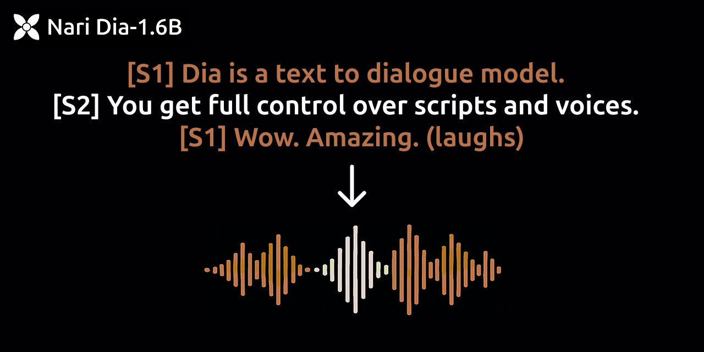

<p align="center">
<a href="https://github.com/nari-labs/dia">

</a>
</p>
<p align="center">
<a href="https://tally.so/r/meokbo" target="_blank"></a>
<a href="https://discord.gg/bJq6vjRRKv" target="_blank"></a>
<a href="https://github.com/nari-labs/dia/blob/main/LICENSE" target="_blank"></a>
</p>
<p align="center">
<a href="https://huggingface.co/nari-labs/Dia-1.6B-0626"></a>
<a href="https://huggingface.co/spaces/nari-labs/Dia-1.6B"></a>
</p>

Dia is a 1.6B parameter text to speech model created by Nari Labs.

**UPDATE 🤗(06/27)**: Dia is now available through [Hugging Face Transformers](https://github.com/huggingface/transformers)!

Dia **directly generates highly realistic dialogue from a transcript**. You can condition the output on audio, enabling emotion and tone control. The model can also produce nonverbal communications like laughter, coughing, clearing throat, etc.

To accelerate research, we are providing access to pretrained model checkpoints and inference code. The model weights are hosted on [Hugging Face](https://huggingface.co/nari-labs/Dia-1.6B-0626). The model only supports English generation at the moment.

We also provide a [demo page](https://yummy-fir-7a4.notion.site/dia) comparing our model to [ElevenLabs Studio](https://elevenlabs.io/studio) and [Sesame CSM-1B](https://github.com/SesameAILabs/csm).

- We have a ZeroGPU Space running! Try it now [here](https://huggingface.co/spaces/nari-labs/Dia-1.6B-0626). Thanks to the HF team for the support :)
- Join our [discord server](https://discord.gg/bJq6vjRRKv) for community support and access to new features.
- Play with a larger version of Dia: generate fun conversations, remix content, and share with friends. 🔮 Join the [waitlist](https://tally.so/r/meokbo) for early access.

## Generation Guidelines

- Keep input text length moderate 
    - Short input (corresponding to under 5s of audio) will sound unnatural
    - Very long input (corresponding to over 20s of audio) will make the speech unnaturally fast.
- Use non-verbal tags sparingly, from the list in the README. Overusing or using unlisted non-verbals may cause weird artifacts.
- Always begin input text with `[S1]`, and always alternate between `[S1]` and `[S2]` (i.e. `[S1]`... `[S1]`... is not good)
- When using audio prompts (voice cloning), follow these instructions carefully:
    - Provide the transcript of the to-be cloned audio before the generation text.
    - Transcript must use `[S1]`, `[S2]` speaker tags correctly (i.e. single speaker: `[S1]`..., two speakers: `[S1]`... `[S2]`...)
    - Duration of the to-be cloned audio should be 5~10 seconds for the best results.
        (Keep in mind: 1 second ≈ 86 tokens)
- Put `[S1]` or `[S2]` (the second-to-last speaker's tag) at the end of the audio to improve audio quality at the end

## Quickstart

### Transformers Support

We now have a [Hugging Face Transformers](https://github.com/huggingface/transformers) implementation of Dia! You should install `main` branch of `transformers` to use it. See [hf.py](hf.py) for more information.

<details>
<summary>View more details</summary>

Install `main` branch of `transformers`

```bash
pip install git+https://github.com/huggingface/transformers.git
# or install with uv
uv pip install git+https://github.com/huggingface/transformers.git
```

Run `hf.py`. The file is as below.

```python
from transformers import AutoProcessor, DiaForConditionalGeneration


torch_device = "cuda"
model_checkpoint = "nari-labs/Dia-1.6B-0626"

text = [
    "[S1] Dia is an open weights text to dialogue model. [S2] You get full control over scripts and voices. [S1] Wow. Amazing. (laughs) [S2] Try it now on Git hub or Hugging Face."
]
processor = AutoProcessor.from_pretrained(model_checkpoint)
inputs = processor(text=text, padding=True, return_tensors="pt").to(torch_device)

model = DiaForConditionalGeneration.from_pretrained(model_checkpoint).to(torch_device)
outputs = model.generate(
    **inputs, max_new_tokens=3072, guidance_scale=3.0, temperature=1.8, top_p=0.90, top_k=45
)

outputs = processor.batch_decode(outputs)
processor.save_audio(outputs, "example.mp3")
```

</details>

### Run with this repo

<details>
<summary> Install via pip </summary>

```bash
# Clone this repository
git clone https://github.com/nari-labs/dia.git
cd dia

# Optionally
python -m venv .venv && source .venv/bin/activate

# Install dia
pip install -e .
```

Or you can install without cloning.

```bash
# Install directly from GitHub
pip install git+https://github.com/nari-labs/dia.git
```

Now, run some examples.

```bash
python example/simple.py
```
</details>


<details>
<summary>Install via uv</summary>

You need [uv](https://docs.astral.sh/uv/) to be installed.

```bash
# Clone this repository
git clone https://github.com/nari-labs/dia.git
cd dia
```

Run some examples directly.

```bash
uv run example/simple.py
```

</details>

<details>
<summary>Run Gradio UI</summary>

```bash
python app.py

# Or if you have uv installed
uv run app.py
```

</details>

<details>
<summary>Run with CLI</summary>

```bash
python cli.py --help

# Or if you have uv installed
uv run cli.py --help
```

</details>

> [!NOTE]
> The model was not fine-tuned on a specific voice. Hence, you will get different voices every time you run the model.
> You can keep speaker consistency by either adding an audio prompt, or fixing the seed.

> [!IMPORTANT]
> If you are using 5000 series GPU, you should use torch 2.8 nightly. Look at the issue [#26](https://github.com/nari-labs/dia/issues/26) for more details.

## Features

- Generate dialogue via `[S1]` and `[S2]` tag
- Generate non-verbal like `(laughs)`, `(coughs)`, etc.
  - Below verbal tags will be recognized, but might result in unexpected output.
  - `(laughs), (clears throat), (sighs), (gasps), (coughs), (singing), (sings), (mumbles), (beep), (groans), (sniffs), (claps), (screams), (inhales), (exhales), (applause), (burps), (humming), (sneezes), (chuckle), (whistles)`
- Voice cloning. See [`example/voice_clone.py`](example/voice_clone.py) for more information.
  - In the Hugging Face space, you can upload the audio you want to clone and place its transcript before your script. Make sure the transcript follows the required format. The model will then output only the content of your script.


## 💻 Hardware and Inference Speed

Dia has been tested on only GPUs (pytorch 2.0+, CUDA 12.6). CPU support is to be added soon.
The initial run will take longer as the Descript Audio Codec also needs to be downloaded.

These are the speed we benchmarked in RTX 4090.

| precision | realtime factor w/ compile | realtime factor w/o compile | VRAM |
|:-:|:-:|:-:|:-:|
| `bfloat16` | x2.1 | x1.5 | ~4.4GB |
| `float16` | x2.2 | x1.3 | ~4.4GB |
| `float32` | x1 | x0.9 | ~7.9GB |

We will be adding a quantized version in the future.

If you don't have hardware available or if you want to play with bigger versions of our models, join the waitlist [here](https://tally.so/r/meokbo).

## 🪪 License

This project is licensed under the Apache License 2.0 - see the [LICENSE](LICENSE) file for details.

## ⚠️ Disclaimer

This project offers a high-fidelity speech generation model intended for research and educational use. The following uses are **strictly forbidden**:

- **Identity Misuse**: Do not produce audio resembling real individuals without permission.
- **Deceptive Content**: Do not use this model to generate misleading content (e.g. fake news)
- **Illegal or Malicious Use**: Do not use this model for activities that are illegal or intended to cause harm.

By using this model, you agree to uphold relevant legal standards and ethical responsibilities. We **are not responsible** for any misuse and firmly oppose any unethical usage of this technology.

## 🔭 TODO / Future Work

- Docker support for ARM architecture and MacOS.
- Optimize inference speed.
- Add quantization for memory efficiency.

## 🤝 Contributing

We are a tiny team of 1 full-time and 1 part-time research-engineers. We are extra-welcome to any contributions!
Join our [Discord Server](https://discord.gg/bJq6vjRRKv) for discussions.

## 🤗 Acknowledgements

- We thank the [Google TPU Research Cloud program](https://sites.research.google/trc/about/) for providing computation resources.
- Our work was heavily inspired by [SoundStorm](https://arxiv.org/abs/2305.09636), [Parakeet](https://jordandarefsky.com/blog/2024/parakeet/), and [Descript Audio Codec](https://github.com/descriptinc/descript-audio-codec).
- Hugging Face for providing the ZeroGPU Grant.
- "Nari" is a pure Korean word for lily.
- We thank Jason Y. for providing help with data filtering.


## ⭐ Star History

<a href="https://www.star-history.com/#nari-labs/dia&Date">
 <picture>
   <source media="(prefers-color-scheme: dark)" srcset="https://api.star-history.com/svg?repos=nari-labs/dia&type=Date&theme=dark" />
   <source media="(prefers-color-scheme: light)" srcset="https://api.star-history.com/svg?repos=nari-labs/dia&type=Date" />
   
 </picture>
</a>
