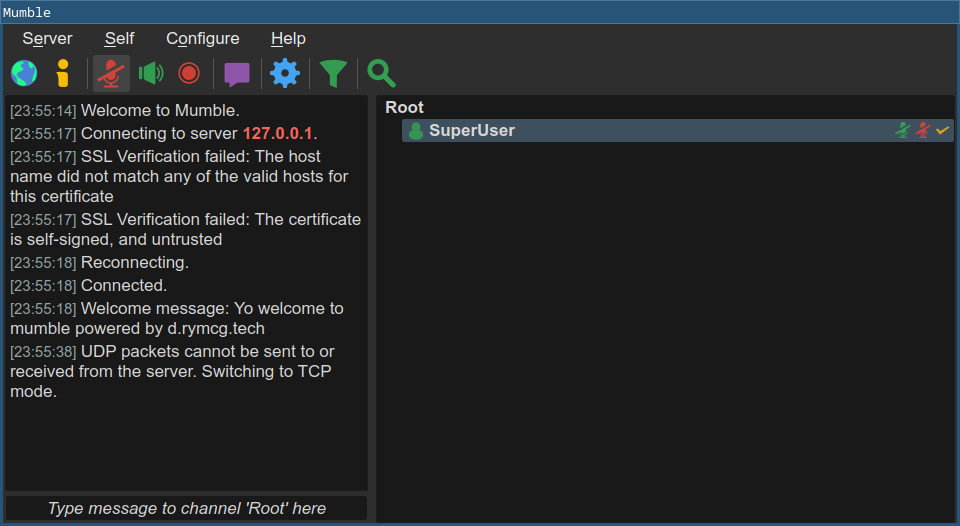

# mumble

[Mumble](https://www.mumble.info/) is a low latency group voice chat system.

## Setup

```
make config
```

## Install

```
make install
```

This takes almost an eternity to build, sorry about that. Just be
patient.

## Background info on Mumble

Here is some knowledge dump about Mumble that you may want to know:

 * Mumble has Channels, and Users, that form a hierachical tree/list
   structure.
 * Channels are audio rooms where users in the same room can speak
(VoIP audio) and/or type text to one another.
 * The `Root` channel holds *all* the channels and users. The `Root`
   is at the top, and everything else is below it.
 * Channels can be nested, to support sub-channels, and sub-channels
   can have sub-sub-channels, and so-on. Channels may be moved
   (dragged) around in the hierarchy as desired. The `Root` channel is
   the only channel that cannot be moved, nor renamed (apparently).\
 * Users are free (by default) to traverse this entire tree and to
   visit any channel in the structure. While users can only be "in" a
   single room at a time, they may "listen" to more than one one at
   the same time. Users can only speak into the room that they are
   currently "in" (but an admin may also link a channel audio
   together.)
 * Channels may be removed, and if they have sub-channels, they will
   be removed as well. If there are users currently in any of these
   channels, they will be moved into the parent channel (or the
   closest grand-parent that isn't being removed for deeper
   sub-trees).
 * By default, anyone may freely join the server, and register their
   own username. Clients automatically generate a certificate which
   identities the registered user.
 * The `SuperUser` can create groups and organize users and apply
   Access Control Lists (ACLs) to limit/grant what these groups are
   allowed to do, and where they can go, on the server.
 * ACLs work top-to-bottom, where the top is applied first, and then
   the bottom rows overwrite the rules above it. Another way to think
   about it, is that the rule on the *bottom* has the *highest*
   priority.
 * The `SuperUser` can create new channels, and these will stay
   permanently in the list (unless deleted).
 * By default, all users can can freely create Temporary channels,
   which are created ephemerally, and automatically removed once the
   last user leaves the channel.
 * The user that creates a channel, becomes the administrator of that
   channel, and this gives that user broad control to edit the
   permissions of that channel, and its sub-channels. However, no
   sub-channel may override the global permissions set by the
   `SuperUser`.
 * There are actually two different types of users:
   * Unregistered users
   * Registered users
 * Unregistered users may not create any channels, however, by
   default, unregistered users are allowed to register themselves (by
   right clicking their name and selecting `Register`).
 * By default, any registered user is allowed to create Temporary
   channels.

## Manual Server Configuration

There is not much in the way of customization from the `.env` file, as
most of the mumble configuration is designed to be done at runtime
with the GUI client, and using the `SuperUser` account to do it. This
could probably be automated somehow so that configuration from the
`.env` file would make an API call to the mumble RPC service to make
the configured changes automatically... but I haven't figured out how
to do that yet. (Contrary to how most d.rymcg.tech apps are
configured, this ad-hoc configuration, and delegation, from the client
itself could be a powerful and flexible asset, so lets roll with it,
and just document the process.)

For now, these are the instructions for *manually* configuring a
secure mumble service:

 * Get the `SuperUser` credentials, run: `make open`.
 * In your mumble client create a new server configuration:
   * Enter the address, port, username, and password printed from the
     output of `make open`.
   * Don't use the default label (Which only includes the server name
     by default), instead give it a good name like
     `SuperUser@my_server`, so that you can tell this config apart
     from other configs you will create later.
 * Connect to the `SuperUser@my_server` account.

You should now find yourself logged in, and see yourself as the
`SuperUser` (in bold text, to indicate yourself, I think) and you are
placed, alone, in a list directly beneath a `Root` node:




### Locking down privileges

For this example, lets lock down the server a bit, to limit what newly
created users are allowed to do.

 * Right click on the `Root` node to open the context menu, and then
   select `Edit...`. This will open the `Root` channel edit window.
 * Click on the `ACL` tab.
 * The list of `Active ACLs` shows all the rules that govern the
   `Root` channel, and all the channels that will be created below it.
   This includes a default configuration, but for this demonstration
   we will remove it all and start from scratch.
 * The very top of the `Active ACLs` list has the `@all` item in
   italics, this is the default ACL and it cannot be removed or
   deleted. It is always at the top, and therefore always has the
   *lowest* priority.
 * Go ahead and delete all the other ACLs below it. (In my case I see
   `@admin`, `@auth`, `@all` [a second one]). Click each one, and
   press the `Remove` button, in turn. At the end you should see just
   the single `@all` item (in italics) which is the one you can't
   remove.
 * To override the default, you will now create a new ACL below it
   (below means *higher* priority): Make sure the `Inherit ACLs` is
   left unchecked, and then click the `Add` button, and a new `@all`
   item will appear beneath it.
 * With the new `@all` ACL selected, you can choose new Permissions in
   the list on the right side:
   * Click on the `Deny` column for everything in the permissions
     list, *except* for the following:
      * Allow `Traverse`.
      * Allow `Register Self`.
   * Click `OK` to close the window.

To recap: at this point you have created an ACL for the `Root` node
that denies all users from doing practically everything:

 * Anyone may still join the server, using any username they want.
 * However, they can only join the Root channel, and they won't be
   able to speak, nor listen, nor text, nor even leave this channel.
   They will be able to see the other users and channels in the list,
   and that's about it. All users (except the `SuperUser`) are now
   effectively stuck in the Root channel and they can't do anything or
   move.
 * Create a new connection profile in your mumble client to verify this:
  * Use the same hostname, and port you used before.
  * Make up a brand new username.
  * *Do not enter a password!* (A client certificate will be
    automatically created and used instead; only the `SuperUser`
    account requires a password.)
  * Give it a good label, like `username@my_server`.
  * Try conecting with the new user, and verify that the user cannot
    do very much, or move around.
  * One thign the user *can* do, is register. In the top bar of the
    client click on `Self` and then click `Register...`.
  * Register your new user, and your user will own the username you
    chose from that point onward.

It will be useful at this point to have two clients, one to login with
the `SuperUser` and the other to login with your test user. If you
also need to test more than one test user, you will need to use
another supported device (eg.
[Mumla](https://f-droid.org/en/packages/se.lublin.mumla/) for
Android).

### Build new privilege ACLs from scratch

Log back in as the `SuperUser@my_server`, and you can start to build a
new set of ACLs to allow your users to start doing some stuff:

 * Right click the `Root` channel, click on `Edit...`
 * Open the `Group` tab. In the `Group` dropdown, you type in it to
   create a new group. Create a new group called `users` to represent
   a basic group of authenticated users.
 * Underneath the `Members` list, there is another dropdown next to
   the `Add` button. Type the names of all the users you wish to add
   to the `users` group (these users need to be registered first), and
   click `Add` for each one. If the username appears in italics, then
   this username hasn't been registered, and you won't be able to save
   the usernames that aren't registered. Add the test user that you
   created before to the `users` group.

Now we will create a new ACL for the `users group`:

 * Click on the `ACL` tab in the `Root` channel `Edit...` window.
 * Click the `Add` button and a new item will appear in the `Active
   ACLs` list. (Initially the new item is called `@all`, similar to
   the one above it.)
 * In the `User/Group` menu, select the `Group` for the new ACL:
   select `users`, and you will see that the ACL has also been renamed
   to `@users`.
 * Make sure both of the checkboxes are checked for this ACL:
  * `Applies to sub-channels` should be checked.
  * `Applies to this channel` should be checked.
 * Select these Permissions for the `@users` ACL:
  * Allow `Enter` (this allows users to enter this channel)
  * Allow `Speak` (this allows users to speak in channels (audio))
  * Allow `Whisper` (this allows users to speak directly to other channel users)
  * Allow `Text Message` (this allows users to type text to the channel)
  * Allow `Make temporary` (this allows users to create temporary
    sub-channels inside this one)
  * Allow `Listen` (this allows users to listen to this channel)
 * Click `OK` to close the edit window.
 * Now you should find that the test user that is added to the `users`
   group can do all of those things that the ACL grants them.


