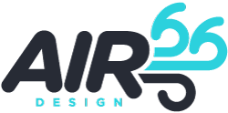
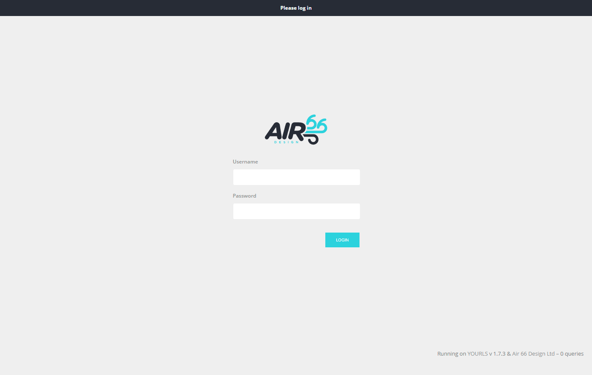
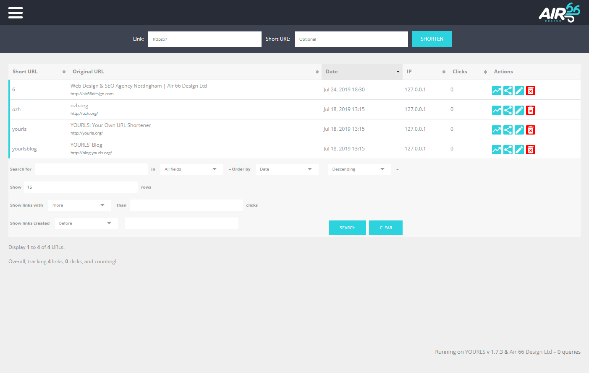
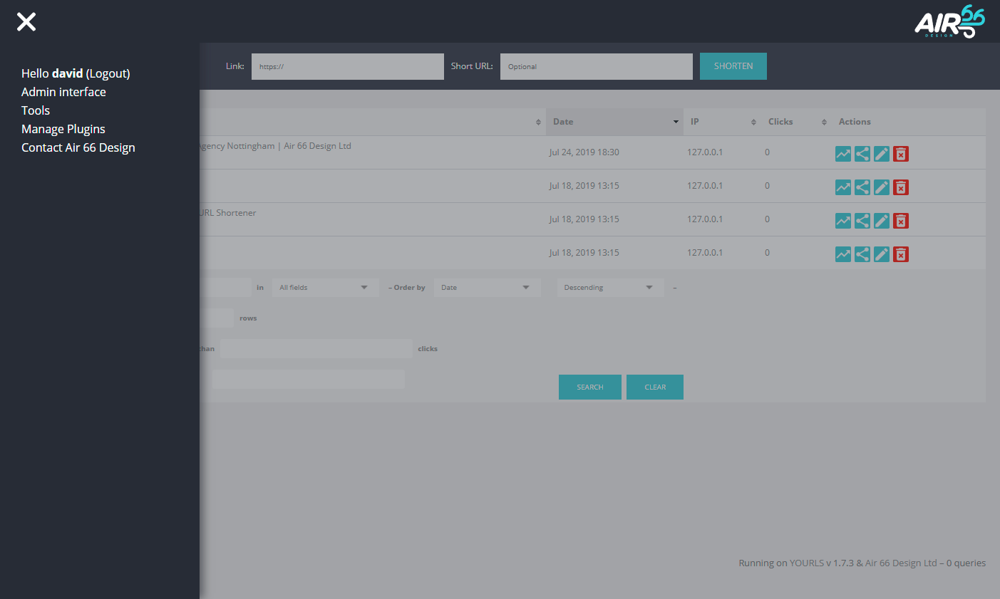

# Air 66 Design YOURLS Admin Theme

This is a responsive admin theme for use with [YOURLS](https://github.com/YOURLS/YOURLS), a self hosted set of PHP scripts that let you run your own URL shortener.

The theme includes a slide in off page navigation, fixed below the nav url shortener on laptop and desktop and a relative postioned url shortener on mobile.

The tables and graphs have a horizontal scroll on mobile when the viewport becomes too small.

**[Air 66 Design Website](https://air66design.com)**

## Screen Shots

**LOGIN PAGE**

**ADMIN PAGE**

**NAV OPEN**

## Installing

1. First install the YOURLS scripts and database.
2. Download or clone this repo into the plugins folder in your YOURLS install `user/plugins/`.
3. Login into the admin area of YOURLS and activate the plugin.
4. The Air 66 Admin Theme is now active.

## Customisation & Use

Feel free to use and customise this theme as you like. If you would like us to make changes to suit your needs please contact us via our [website form](https://air66design.com/contact).

## License

This project is licensed under the MIT License - see the [LICENSE.md](LICENSE.md) file for details

## Acknowledgments

* We took inspiration from the layout and design of [Sleeky](https://github.com/Flynntes/Sleeky) and used a number of their styles for the tables and other elements.
* [YOURLS](https://github.com/YOURLS/YOURLS) The URL shortener PHP scripts.
